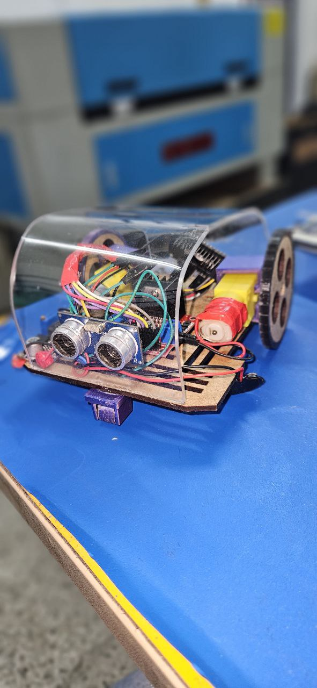

# Projeto Mitch-S.O.S 

# INTRODUÇÃO

Este projeto é um protótipo de um sistema de assistência destinado a ajudar pessoas em situações de alagamento ou enchentes. Utilizando o microcontrolador ESP8266, a ideia é criar uma solução que possa ser expandida para um modelo em cápsula, facilitando o resgate e a comunicação em áreas de difícil acesso.

## Visão Geral
Python: Captura e processa imagens em tempo real, reconhece gestos específicos das mãos usando MediaPipe e envia comandos via WebSocket.

Java: Uma API em Spring Boot que gerencia o recebimento de comandos.

C++: Responsável pelo controle de hardware, utilizando um microcontrolador para ativar/desativar motores do robô.

Pré-requisitos
Python 3.8+
OpenCV
MediaPipe
SpeechRecognition
WebSocket (WebSocket Client)
Java JDK 11+
Spring Boot 2.5+
WebSocket Library
C++:

# Explicação Python
Python - Visão Computacional
Funcionalidade: Utiliza a biblioteca MediaPipe para reconhecimento de gestos com a câmera. Identifica se todos os dedos estão levantados, apenas um ou se a mão está fechada.
Comandos:
socorro: Enviado quando ambas as mãos estão levantadas ou uma mão está com todos os dedos levantados (dependendo do contexto).  Após isso envia ao Websocket que passa ao ESP8266 que retorna a latitude e longitude 
podendo assim abri um mapa com a localização do robô.
parar: Enviado quando uma mão está fechada ou há inconsistências entre as mãos.
girar: Enviado quando o dedo indicador está levantado.

# Execução: 
Abre uma conexão WebSocket e envia os comandos conforme os gestos detectados.

# Explicação Java 
Funcionalidade: Recebe comandos do WebSocket e processa-os. Utiliza Spring Boot para criar um servidor WebSocket que responde a socorro, parar, e girar. Sua conexão 
bidirecional faz com que todos seus ouvintes recebão a mensagem que nela foi entroduzida.

Comandos:
socorro: Se amensagem for socorro envia ao ESP8266 que retorna, a latitude e longitude ao remetente
parar: Para o hardware parar
girar: envia a mensagem para o ESP8266 girar.
Execução: Configurado para escutar o WebSocket.

## C++/ esp8266
Funcionalidade: Controla o hardware conectado ao microcontrolador (ESP8266). Ativa os motores, etc., conforme os comandos socorro, parar, e girar.
Execução: Configurado para escutar comandos da API e agir diretamente sobre o hardware. Ele se conecta a api de geolocalização da google caso o comando seja **socorro**
o ESP8266 faz uma busca por redes wifi e sinais de torre para monitorar a localização direta.
Após é retornado para API websocket java a Longitude e Latirude e por final a programção em python fica escutando está porta e  mostra um mapa para encontrar a pessoas que precisa de ajuda
